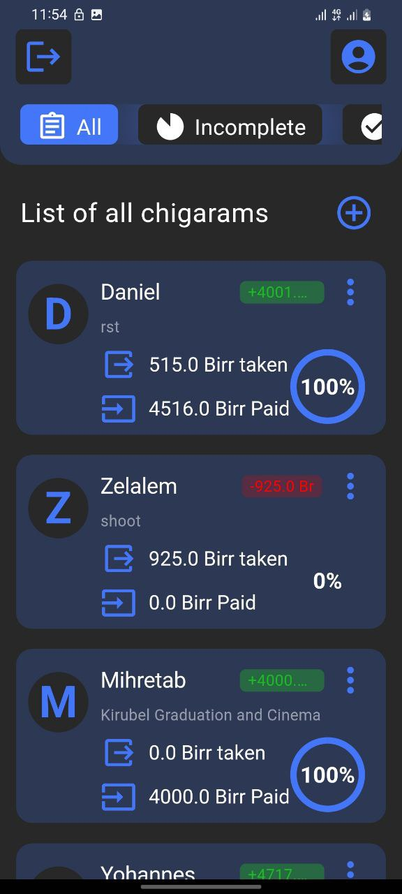
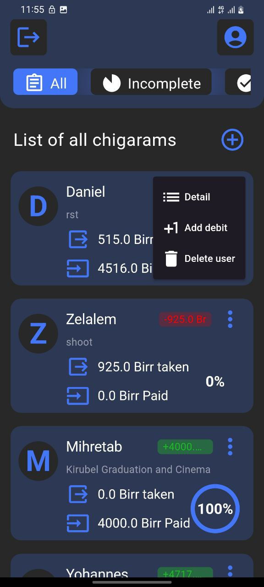
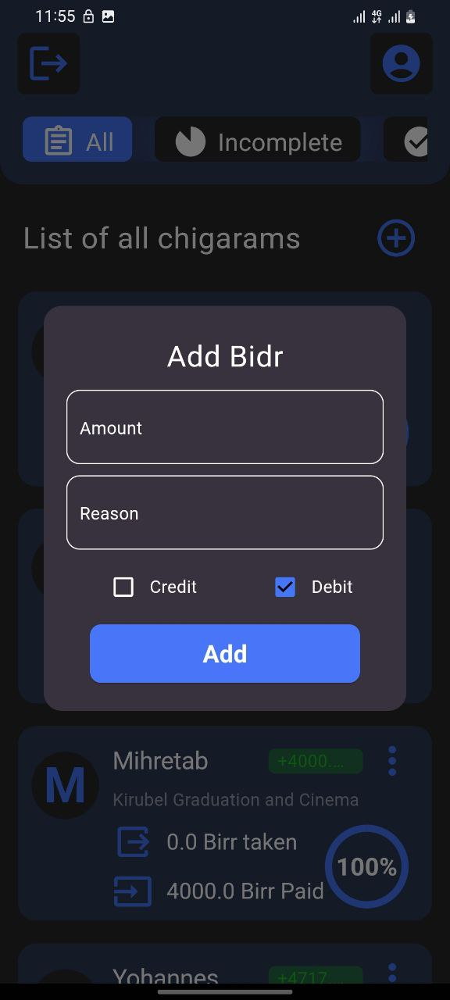
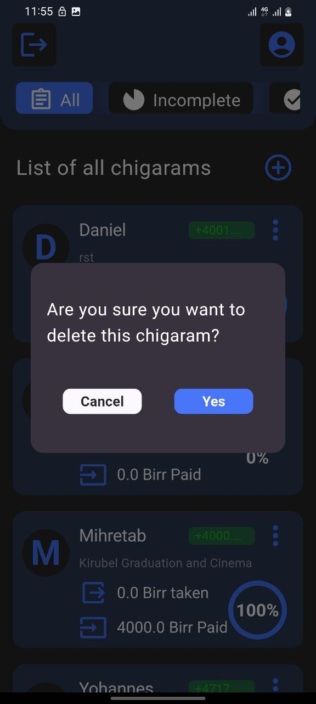
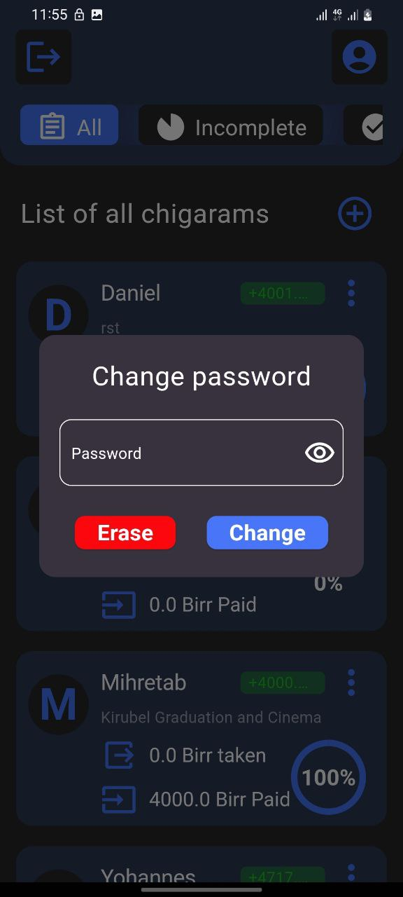
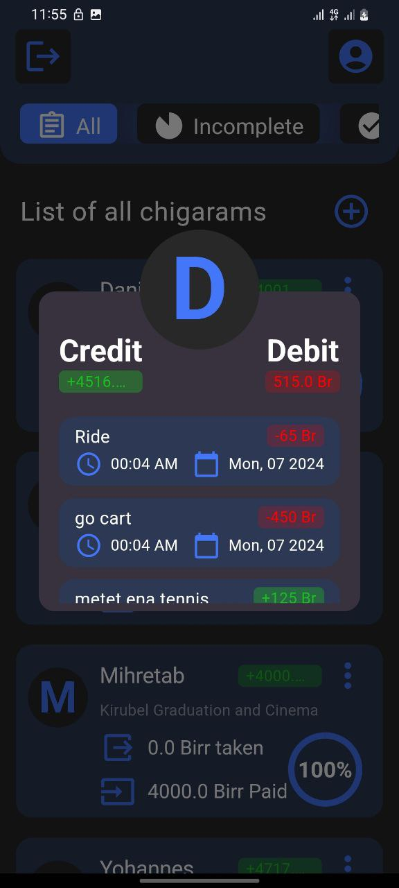

# Loan Tracker App

## Overview

Loan Tracker is a Flutter application designed to help you keep track of the loans you give to your friends. With this app, you can easily add friends, track the loans you have given to each of them, and categorize these loans using loan trackers. The app uses Hive DB to cache data locally and BLoC for state management.

## Features

- **Add Friends**: Easily add your friends to the app.
- **Track Loans**: Record and keep track of loans given to your friends.
- **Loan Categorization**: Categorize loans for better organization and tracking.
- **Local Data Storage**: Uses Hive DB to cache data locally for offline access.
- **State Management**: BLoC is used for efficient state management.

## Screenshots

<p>
    
    
    
    
    
    
</p>

## Installation

1. **Clone the repository**
   ```sh
   git clone https://github.com/leulabay1/loan_tracker.git
   cd loan_tracker
   ```

2. **Install dependencies**
   ```sh
   flutter pub get
   ```

3. **Run the app**
   ```sh
   flutter run
   ```

## Usage

1. **Add a Friend**
   - Tap the "Add Friend" button.
   - Enter the friend's name and save.

2. **Add a Loan**
   - Select a friend from the list.
   - Tap the "Add Loan" button.
   - Enter loan details such as amount, description, and category.
   - Save the loan.

3. **View Loans**
   - Select a friend from the list to view all loans given to them.
   - Loans are categorized for easy tracking.

## Technologies Used

- **Flutter**: For building the cross-platform mobile application.
- **Hive DB**: For local data storage.
- **BLoC**: For state management.

## Contributing

Contributions are welcome! Please follow these steps:

1. Fork the repository.
2. Create a new branch (`git checkout -b feature-branch`).
3. Make your changes.
4. Commit your changes (`git commit -m 'Add some feature'`).
5. Push to the branch (`git push origin feature-branch`).
6. Open a pull request.

## License

This project is licensed under the MIT License. See the [LICENSE](LICENSE) file for details.

## Contact

If you have any questions or feedback, feel free to reach out at your-email@example.com.

---

Thank you for using Loan Tracker! Happy loan tracking!
